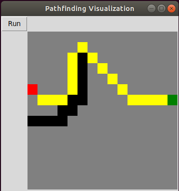

# Pathfinding Visualization

This is my first attempt at pathfinding. I made this visualization to show the beauty of pathfinding.

## Basic Controls
Map's creating automaticly (15x15 nodes). First click will create start node and fill it red, second click is end node this one is green and the walls are black. To start pathfinding press "Run" button.

